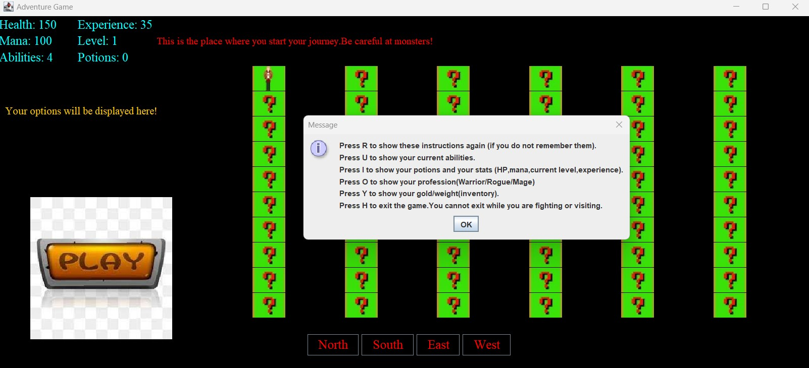
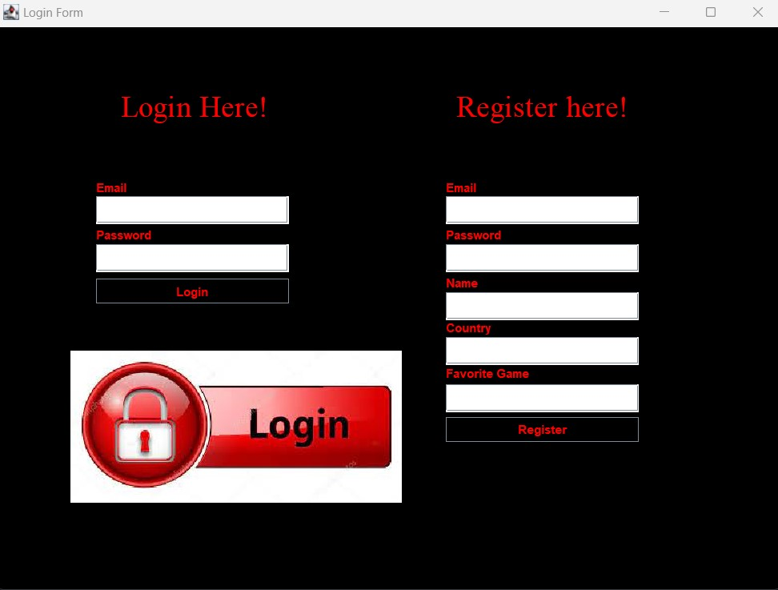

# RPG-Adventure-Game
- Designed a Complex RPG based game using Java and JSON files for storing accounts used for logging in the game.

- Implemented a functionality which allows the player to choose between 2 game formats (GUI and CLI).

- If GUI format is desired, the player can choose between a randomly generated map or a fixed map.

- Defeat enemies, increase your level and your damage, earn gold, buy potions from shops and be victorious!

- The goal of the game is to find the final cell in the given map (each cell has it's own story shown).

- Note that the project's structure is in IntelliJ IDEA format.

A picture which displays a generated map in GUI format.

A picture which shows the posibility of creating an account or logging in.

